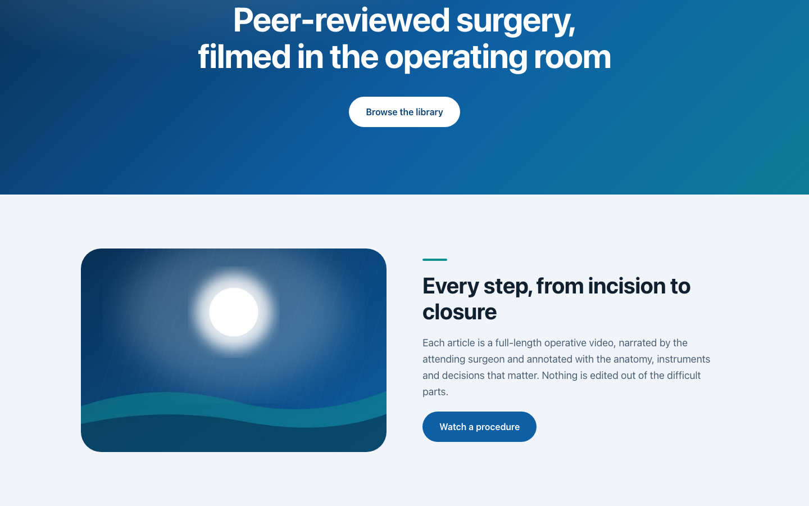
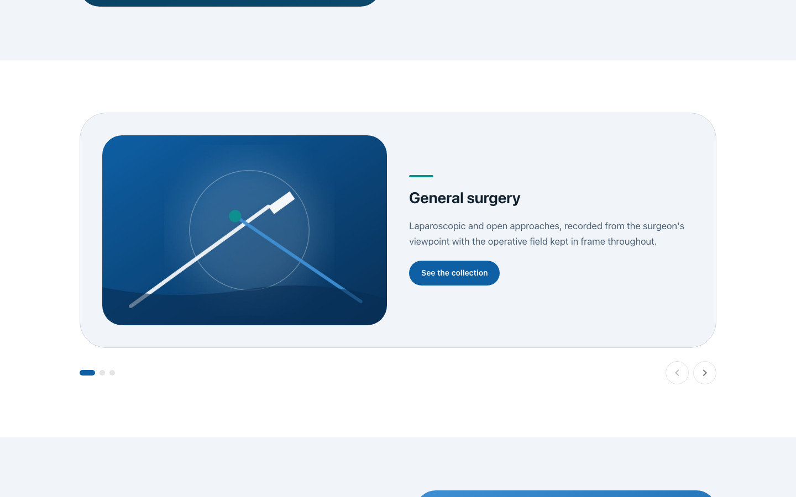
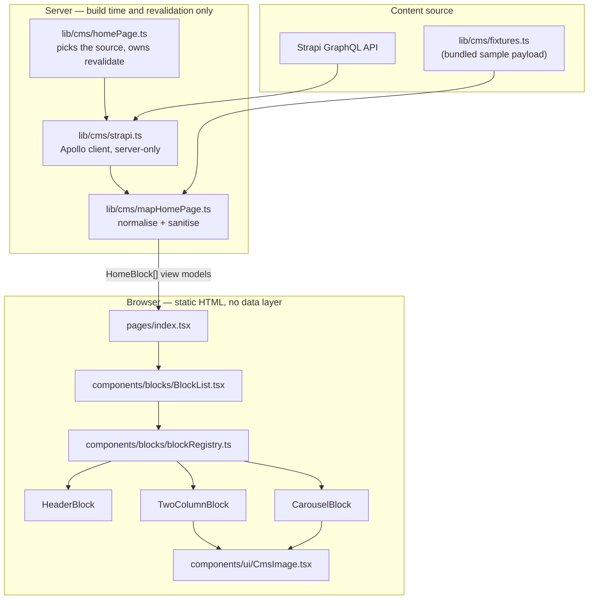
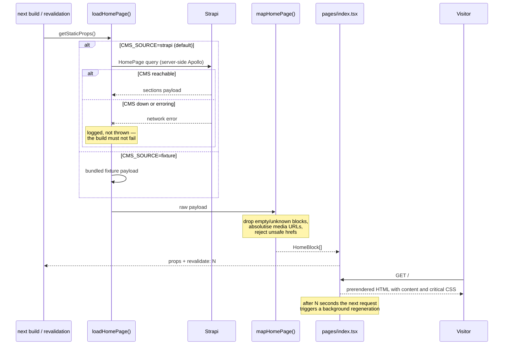

# JOMI Code Challenge — Front-end

A Next.js front-end for the JOMI CMS coding challenge. It reads the `homePage`
single type out of a [Strapi](https://strapi.io/) CMS over GraphQL and renders
its `sections` **dynamic zone** — a heterogeneous, editor-ordered list of
content blocks — by mapping each block's GraphQL `__typename` onto a React
component through a registry.

The page is prerendered on the server and revalidated on a timer, so the HTML a
visitor receives already contains the content: no client-side query, no loading
spinner, and no CMS credentials in the browser bundle.

The accompanying backend and the original brief live in
[`jomijournal/jomi-cms-challenge-backend`](https://github.com/jomijournal/jomi-cms-challenge-backend).
This repository is the front-end half only; it does not contain the CMS.

## Screenshots

Captured with `yarn screenshots` (Playwright, Chromium, 1440x900 and 390x844)
against the production build running on the bundled fixture content, so they
are reproducible without a CMS.

| The homepage (1440x900) |
| --- |
|  |

| A two-column section | The carousel |
| --- | --- |
|  |  |

| Mobile (390x844) |
| --- |
|  |

The artwork is generated, not stock photography — see `scripts/generate-seed-art.mjs`.

## Architecture



Dependencies point inward: the blocks know only about the view models in
`lib/cms/blocks.ts`. Nothing under `components/` imports Apollo, the generated
GraphQL types, or `process.env`.

## How a page render works



## Quickstart

```bash
docker compose up --build
# then open http://localhost:8261
```

That is the whole thing. The image is built against the bundled fixture
content, so the page is fully populated with no Strapi instance anywhere. To
build it against a real CMS, put `CMS_SOURCE=strapi` and `STRAPI_URL` in a
`.env` file next to `docker-compose.yml` and rebuild — the homepage is
prerendered at build time, so the source is chosen then.

Without Docker:

```bash
yarn install
cp .env.example .env     # defaults to CMS_SOURCE=fixture
yarn dev                 # http://localhost:8261
```

## Configuration

Every variable is read on the **server only**. `next.config.js` inlines nothing
into the browser bundle, so the CMS address and token never reach a visitor.

| Variable | Required | Default | What it does |
| --- | --- | --- | --- |
| `CMS_SOURCE` | no | `strapi` | `strapi` queries the live CMS; `fixture` renders the bundled sample payload in `lib/cms/fixtures.ts`, so the app builds and boots with no CMS running. Any other value is treated as `strapi`. |
| `STRAPI_URL` | when `CMS_SOURCE=strapi` | `http://localhost:1337/graphql` | GraphQL endpoint of the Strapi CMS. Falls back to the default with a development warning when unset. |
| `STRAPI_CMS_URL` | no | — | Origin of the Strapi instance. Its hostname is added to `images.domains` so `next/image` may load CMS media, and it is prefixed onto the root-relative URLs Strapi's local upload provider returns. |
| `STRAPI_TOKEN` | no | — | Strapi API token, sent as `Authorization: Bearer …`. Unset means the public, unauthenticated endpoint. |
| `CMS_REVALIDATE_SECONDS` | no | `60` | Seconds between ISR regenerations of the homepage. A non-positive or unparseable value warns and falls back to the default. |
| `SCREENSHOT_PORT` | no | `8261` | Port `yarn screenshots` starts the production server on. |

`.env.example` documents the same set. It contains placeholders only — never
commit a real token.

## Development

```bash
yarn install
yarn dev                  # dev server on http://localhost:8261
yarn build                # production build; prerenders "/"
yarn start                # serve the production build on 8261
yarn test                 # jest
yarn test:coverage        # jest with coverage
yarn lint                 # next lint (ESLint + jsx-a11y + @typescript-eslint)
yarn typecheck            # tsc --noEmit, strict mode
yarn screenshots          # rebuild docs/screenshots (needs `yarn build` first)
yarn seed:art             # regenerate the seed artwork in public/seed
yarn gen                  # regenerate GraphQL types from a live Strapi schema
```

`yarn gen` introspects the schema over the network at the URL in
`graphql.config.yml`, so Strapi must be running. The generated files are
committed so the app builds without the CMS present; `graphql/cms/homepage.generated.tsx`
carries a header noting the two places it has been hand-edited and why.

### Tests

Jest with the `jsdom` environment and Testing Library, wrapped in `next/jest`
so the SWC transform and the `baseUrl`-style imports apply. Tests never reach
the network: `jest.setup.ts` installs a `fetch` stub that rejects loudly, and
also stubs `IntersectionObserver`, which jsdom lacks and `next/image` needs
before it will swap in a real source.

```bash
yarn test                      # whole suite
yarn test --watch              # watch mode
yarn test TwoColumnBlock       # one file by path fragment
```

Test files sit next to the code in `__tests__` directories, except page tests —
Next.js treats every file under `pages/` as a route, so those live in
`__tests__/pages/`.

## Project structure

```
components/
  blocks/
    registry.ts            the seam: defineBlock/createBlockRegistry, types
    blockRegistry.ts       the wiring: every block definition + completeness check
    BlockList.tsx          renders a dynamic zone by looking each block up
    HeaderBlock.tsx        hero band            (ComponentCommonHeader)
    TwoColumnBlock.tsx     image/text section   (ComponentCommonTwoColumnBlock)
    CarouselBlock.tsx      scroll-snap carousel (ComponentCommonCarousel)
    TwoColumnContent.tsx   the pairing shared by the section and the slides
  ui/CmsImage.tsx          next/image wrapper: reserved box, skeleton, sizes
  layout/                  EmptyState, PageFooter
lib/
  cms/blocks.ts            view models the UI renders (the inward contract)
  cms/mapHomePage.ts       GraphQL payload -> view models; the trust boundary
  cms/homePage.ts          source selection (strapi | fixture) + revalidate
  cms/strapi.ts            server-only Apollo client for the CMS
  cms/fixtures.ts          deterministic sample payload, in Strapi's own shape
  safeHref.ts              URL sanitiser for CMS-supplied links
  createEmotionCache.ts    one Emotion cache per render
theme/index.ts             typography, palette, focus ring, section surfaces
pages/
  _document.tsx            server-side Emotion style extraction
  _app.tsx                 theme + CssBaseline
  index.tsx                the homepage; getStaticProps + ISR
graphql/                   the HomePage document and generated types
scripts/                   screenshot capture, seed artwork, PNG optimiser
test-utils/                render-with-theme helper and block factories
docs/screenshots/          the images used above
```

## Design notes

### The block registry is the seam

A Strapi dynamic zone is an open set: an editor can add a component type at any
time, and the front-end has to cope with types it has never seen. The obvious
implementation is a `switch` on `__typename`, which every new block has to be
threaded through in two or three places.

Instead, each block ships a `defineBlock({ typename, component })` export next
to its component, `blockRegistry.ts` collects them into a `Map`, and
`BlockList` looks each block up. **Adding a block type is one new file plus one
line in the list.** Two guards keep it honest:

- a compile-time completeness check (`ALL_BLOCK_TYPES_REGISTERED`) that fails
  `next build` if a member of the `HomeBlock` union has no component, and
- a runtime skip-with-warning for a `__typename` the app does not know, because
  the CMS can always be ahead of a deploy and one unknown block must not take
  the page down.

### Normalising once, at the trust boundary

Strapi's generated types are deeply optional and wrap media in an entity
response, so rendering straight from them pushes the same defaulting,
absolutising and sanitising into every component. `mapHomePage` does it once
and hands the UI plain, non-optional view models. That is also where CMS input
is treated as untrusted: every link goes through `lib/safeHref.ts`, which
permits only `http:`, `https:`, `mailto:`, `tel:` and relative URLs, so an
editor cannot store a `javascript:` URL that ends up in an `href`.

### Scalability: the bottleneck was the client bundle

The page has one query and no user input, so there is no N+1 and nothing to
paginate. The real cost was that the whole Apollo Client, the normalised cache
and the GraphQL document were shipped to every visitor in order to re-run, on
the client, a query whose answer was already in the HTML.

The data layer now lives entirely in `getStaticProps`; `lib/cms/strapi.ts` is
reached through a dynamic `import()` on the Strapi path only, so it is never in
the browser's module graph.

| | Before | After |
| --- | --- | --- |
| First Load JS for `/` | 161 kB | **115 kB** |
| Shared chunks | 132 kB | **87.1 kB** |
| `pages/_app` chunk | 60.9 kB | **16.2 kB** |

(`next build` output, same machine, production mode.)

The other half is caching. `revalidate` is the whole strategy for a page like
this: the HTML is generated once and regenerated at most once per window,
whatever the traffic, and an editor's change appears without a redeploy. The
window is `CMS_REVALIDATE_SECONDS`, so it is tunable per environment.

Media goes through `next/image` with intrinsic dimensions from the CMS, a
`sizes` hint per breakpoint, lazy loading below the fold and a reserved box, so
a 2 MB editor upload is not what a phone downloads and nothing reflows when it
arrives.

### A CMS outage is not a build failure

`getStaticProps` catches and logs; the page renders an empty state that explains
what to do, and the next revalidation picks the content back up. The fixture
path exists for the same reason from the other direction: the build, the tests,
the Docker image and the screenshots all render the same payload through the
same `mapHomePage` pipeline, so none of them can drift from the real code path.

### UI

One theme owns typography, colour, spacing and the focus ring; blocks draw from
it rather than styling themselves, which is the only way a page assembled by an
editor stays coherent. Display type uses `clamp()` so it scales from 360px up
without a stack of breakpoint overrides, section surfaces alternate by position
in the dynamic zone, and `prefers-reduced-motion` is respected. The carousel is
a native scroll-snap track — it works with touch, trackpad and keyboard before
any JavaScript runs — with labelled controls and no auto-advance.

## Limitations

- **One page.** The challenge is the `homePage` single type; there is no
  routing, no article page and no search.
- **No CSP.** MUI/Emotion inject styles at runtime, so a useful policy needs a
  nonce plumbed through `_document`. The other standard security headers are
  set in `next.config.js`.
- **`yarn gen` needs a live Strapi.** The committed generated files have been
  hand-edited twice, which the file header records; a schema change means
  regenerating against a running CMS.
- **The carousel has no auto-advance and no infinite loop.** Deliberate, but it
  is a difference from most marketing carousels.
- **The fixture is not the CMS.** It exercises the same mapping code, but it
  cannot catch a schema drift in Strapi itself; only `yarn gen` against the
  live schema does that.
- **Docker image not built in this environment.** The `Dockerfile` and
  `docker-compose.yml` are written to the same standard as the rest of the
  repository and `docker compose config` parses, but the image has not been
  built here.
